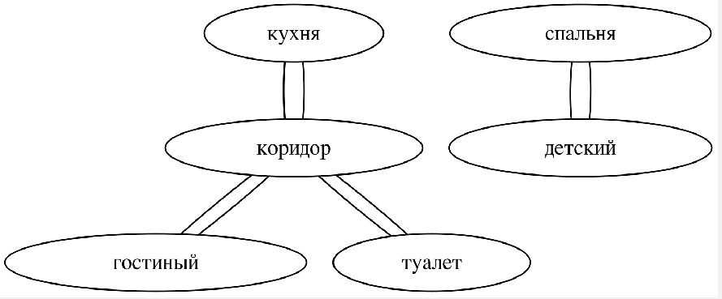

# Draws a graph from a text

## Make sure to install [dotplugin](https://plugins.jetbrains.com/plugin/10312-dotplugin) in PyCharm to beautifully preview graphs

## Supports only Russian language! (Because it works on [natasha](https://github.com/natasha/natasha))

### Running the project

1. Open the project in **PyCharm**
2. Install the packages `pip install -r requirements.txt`
3. Run `main.py` with `python3 main.py` or `python main.py`
4. Enter text where each statement is separated by a new line, like here:
```
Кухня соединена с Коридором,
Спальня и Детская соединены
Соединены две комнаты: Гостиная и Коридор
Кухня и Спальня не соединены
Туалет и Коридор соединены
```
5. You'll get a graph file `graph.gv` which you can preview right in **PyCharm** via **dotplugin**


